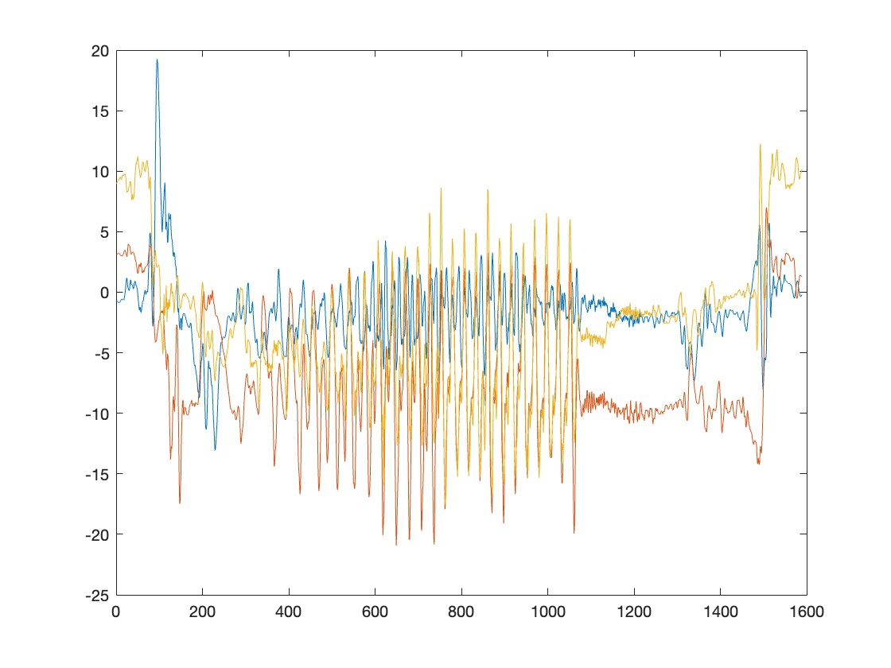

## Signals Systems and Random Processes Assignment

This is the repository for our first assignment of the Signals Systems and Random Processes course under [Prof. Nithin V George](https://iitgn.ac.in/faculty/ee/fac-nithin). This repository contains all files related to our assignment.

### YouTube Video Presentation

We have created a YouTube video presentation to showcase our project. You can watch the video by clicking the link below:

[Watch YouTube Video](https://youtube.com/playlist?list=PLoHQdnz8DvfR4D6OkkULykJi3SMTUBhvY&feature=shared)

## Team Members
---------------------------
- Raghavpravin K S
- Pannala Naga Sheshu Reddy
- Pavan Deekshith Doddi

## Objective of our project
To design an Android/iOS app for child safety monitoring. We aim to create an app that detects overspeeding, accidents, and crossing of boundaries of a child riding a bicycle. 

## Simulink Model
We've created a Simulink model that takes input from the phone's sensors and uses it to detect crashes, overspeeding, and boundary crossings for bicycle monitoring.

It continuously monitors the data from various sensors such as Gyroscope, Accelerometer, GPS sensor, Camera, and microphone to get a sense of what's happening around the phone. 

## How and Where We Started?

### Raw Data Collection
We first wanted to visualize the data from various sensors and how they changed while the phone is in the person's pocket riding a bicycle. The sensors we thought would be helpful for fall detection are Gyroscope, Accelerometer, magnetometer, and GPS sensor. So we went on to collect data for a set of 7 different trips with a mobile phone in the person's pocket.

### Noise
After collecting the data for various trips, the first thing we observed was that each and every sensor's data had a huge amount of noise attenuated to it, disabling us from looking at the mere details of the data.
This is how the raw data looked when we tried to plot it in MATLAB;

#### Raw data from the accelerometer:
Trip 1             |  Trip 2
:-------------------------:|:-------------------------:
 | 

As you can observe from the above data plots, it contains lots of noise, making extracting features difficult without filtering out the noise.

#### Raw data from magnetometer:
Trip 1             |  Trip 2
:-------------------------:|:-------------------------:
 | 

#### Raw data from gyroscope:
Trip 1             |  Trip 2
:-------------------------:|:-------------------------:
 | 

#### Raw data from the Orientation matrix:
Trip 1             |  Trip 2
:-------------------------:|:-------------------------:
 | 

So, to observe them, we must first remove the noise. After spending hours smoothing and cleansing the data, we arrived at this quality:

#### Filtered data from the accelerometer:
Trip 1             |  Trip 2
:-------------------------:|:-------------------------:
 | 

#### Filtered data from magnetometer:
Trip 1             |  Trip 2
:-------------------------:|:-------------------------:
 | 

#### Filtered data from gyroscope:
Trip 1             |  Trip 2
:-------------------------:|:-------------------------:
 | 

#### Filtered data from GPS sensor:
Trip 1             |  Trip 2
:-------------------------:|:-------------------------:
 | 


### Observations from data
- As you can see from the above data when a person is riding a bicycle, his/her leg goes up and down almost periodically to pedal the cycle. Due to this periodic motion of the legs, we can observe a nice sinusoidal-like pattern in almost all sensors' data.
- But this is not the part of the data we are interested in; we want to find and detect some special features corresponding to a fall or accident. When we observe the data after the end of those sinusoidal-like waveforms, those correspond to the activities after the cycle stops.
- As we collected the data, we also recorded a video to keep track of the timeline.
- In order to detect a fall or accident, one has to focus on this part of the signal and try to extract some useful features. By keen observation, we concluded there was a sudden surge in accelerations and angular velocities provided by the gyroscope and accelerometer.

  
### Detection Criteria
- Now, our goal is to set some threshold value to detect this sudden surge in a change of these values. The naive approach to these problems is setting a value by observing the reading from the data above and testing it for tweaking it. However, his approach may not work in all scenarios.
- Our approach is an extended version of this idea. What we did was we wanted our threshold value to be adjusted according to the surroundings according to the changes in parameters of the surroundings. So we employed mean and standard deviation to set the threshold value.
- So our value of threshold continuously changes to adapt to the changes that are taking place in the environment, for example, when the road conditions are harsh or the handlebar of the bicycle may be wobbly. We have to consider all these parameters and decide the threshold value for detecting falls.
- If we observe the plots of accelerations for Trip 1 and Trip 2, it is clearly seen that the sinusoidal-like waveform created while has a higher frequency in the case of Trip 2 than Trip 1; this is because the person riding the bicycle was pedaling fast in Trip 2 compared to Trip 1.
- Factors like these shouldn't affect our detection of falls.


### Refining the detection algorithm
- To detect changes in acceleration and angular velocity, we used a function to find the mean and standard deviation of the input from the sensors to calculate the threshold value.
- Even though this was quite a good way to measure any sudden surges in values from sensors, we needed more accurate detection.
- We devised a function to calculate the phone's orientation by utilizing the sensor fusion concept. Madgwick Orientation Filter to get the Pitch, Yaw, and Roll values in degrees.
- These make our detection easier and more accurate.

### Madgwick Filter

The Magwick filter is a sensor fusion algorithm commonly used to estimate the orientation of a mobile device or vehicle based on accelerometer and gyroscope data. In the context of bicycle fall detection, this filter can provide information about the pitch, yaw, and roll of the bicycle, which can be used to detect falls.

#### Introduction

- The Magwick filter is named after its creator, Sebastian Magwick, and is a variant of the Mahony filter, designed for low-resource applications like mobile devices and microcontrollers. It fuses data from accelerometers (ax, ay, az) and gyroscopes (gx, gy, gz) to estimate the orientation of the device or, in this case, the bicycle.

#### Sensor Fusion

- Sensor fusion is the process of combining data from multiple sensors to obtain a more accurate and reliable estimate of a physical quantity. In the case of the Magwick filter, it fuses accelerometer data (measuring linear acceleration) and gyroscope data (measuring angular velocity) to calculate the orientation (pitch, yaw, and roll) of the bicycle.

#### Estimating Orientation

- The Magwick filter employs a quaternion-based approach to estimate the orientation. Quaternions are mathematical entities that provide a compact representation of orientation. By combining accelerometer and gyroscope data, the filter continuously updates the quaternion representing the bicycle's orientation.

#### Fall Detection

- To detect a fall from the bicycle, you can monitor the estimated pitch, yaw, and roll angles. A sudden change in these angles may indicate a fall. Additionally, you can set specific threshold values for these angles to trigger a fall detection event.

Here's a simplified pseudocode snippet for fall detection using the Magwick filter:

```python
while cycling:
    # Read accelerometer and gyroscope data (ax, ay, az, gx, gy, gz)

    # Use Magwick filter to estimate pitch, yaw, and roll

    if is_fall(pitch, yaw, roll):
        alert_fall_detected()
```

## Challenges in Implementing Bicycle Fall Detection System

### Sensor Integration and Data Synchronization

One of the primary challenges we encountered while developing our bicycle fall detection system was related to sensor integration and data synchronization. Collecting raw data from sensors, such as accelerometers and gyroscopes, is crucial for estimating the orientation of the bicycle accurately. However, ensuring that these sensors provided synchronized data and were properly calibrated proved to be a complex task. Variations in sensor data, even due to minor discrepancies, could result in inaccurate fall detection.

### Real-time Processing

Processing data in real-time posed another significant challenge. We aimed to run our code or Simulink model as a standalone application on an Android phone, which limited our ability to store data for later processing. This constraint meant that all data processing had to be performed in real-time, making it necessary to implement filtering algorithms and other processing steps without the luxury of post-processing. Real-time processing can be computationally intensive and requires efficient algorithms to meet the real-time constraints.

### Algorithm Development and Complexity

The development of algorithms for fall detection on a constrained platform like Android brought its own set of challenges. Many filtering algorithms typically require a continuous array of data to work effectively, which was not straightforward to achieve within the Android Support package for Simulink. We had to implement workarounds, such as using delays to collect previous values and form arrays incrementally. This added complexity to our algorithm design and increased the risk of errors.

### Handling Simulink and MATLAB Errors

Integrating Simulink and MATLAB into our system introduced additional challenges. Ensuring that data types were compatible between different parts of the system was essential, and small errors in data representation or communication between components could lead to unexpected behavior and inaccurate results. Debugging and resolving these issues required a deep understanding of the Simulink and MATLAB environments.

### Inaccuracy in Fall Detection

One significant limitation we faced was the inaccuracy in fall detection. Despite our best efforts, our algorithm was unable to consistently detect falls with high accuracy. Falls can occur in various ways and involve complex motions, making it challenging to create an algorithm that covers all scenarios. False positives and false negatives were common issues, and fine-tuning the algorithm to strike the right balance between sensitivity and specificity was a constant struggle.

### Implementing TCP/IP Protocol for Audio and Video Detection

Apart from sensor-related challenges, we also faced difficulties in implementing the TCP/IP protocol for audio and video detection. Ensuring that audio and video data were transmitted and received reliably in real-time required careful handling of network protocols. Synchronization and latency issues could impact the effectiveness of audio and video-based fall detection, making this aspect of our system particularly challenging.

In conclusion, developing a bicycle fall detection system involves overcoming various technical hurdles related to sensor integration, real-time processing, algorithm complexity, error handling, and the inherent inaccuracy of fall detection algorithms. Additionally, integrating audio and video detection further adds to the complexity of the project. Addressing these challenges requires a combination of engineering expertise, creative problem-solving, and a commitment to refining and optimizing the system continuously.
