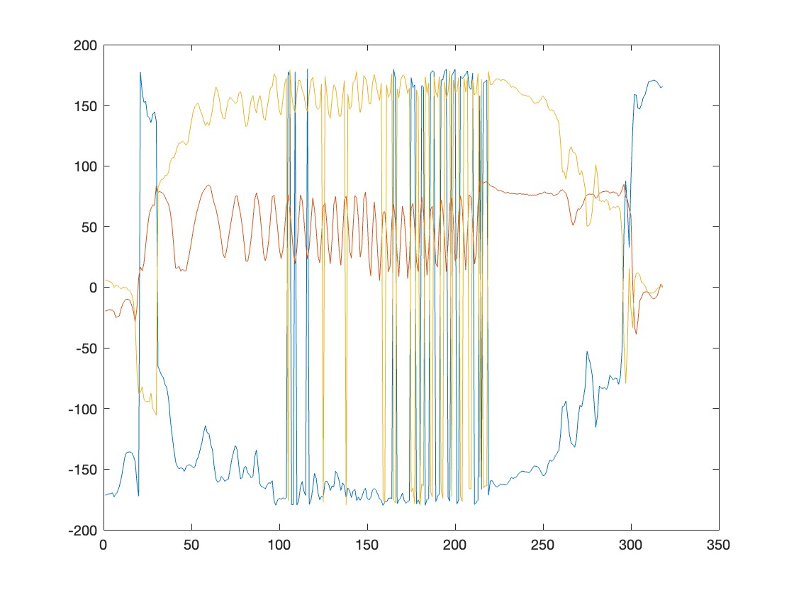

## About
This is the repository for our first assignment of the Signals Systems and Random Processes course under [Prof. Nithin V George](https://iitgn.ac.in/faculty/ee/fac-nithin). This repository contains all files related to our assignment. 

## Team Members
---------------------------
- Raghavpravin K S
- Pannala Naga Sheshu Reddy
- Pavan Deekshith Doddi

## Objective of our project
To design an Android/iOS app for child safety monitoring. We aim to create an app that detects overspeeding, accidents, and crossing of boundaries of a child riding a bicycle. 

## Simulink Model
We've created a Simulink model that takes input from the phone's sensors and uses it to detect crashes, overspeeding, and boundary crossings for bicycle monitoring.

It continuously monitors the data from various sensors such as Gyroscope, Accelerometer, GPS sensor, Camera, and microphone to get a sense of what's happening around the phone. 

## How and Where We Started?

### Raw Data Collection
We first wanted to visualize the data from various sensors and how they changed while the phone is in the person's pocket riding a bicycle. The sensors we thought would be helpful for fall detection are Gyroscope, Accelerometer, magnetometer, and GPS sensor. So we went on to collect data for a set of 7 different trips with a mobile phone in the person's pocket.

### Noise
After collecting the data for various trips, the first thing we observed was that each and every sensor's data had a huge amount of noise attenuated to it, disabling us from looking at the mere details of the data.
This is how the raw data looked when we tried to plot it in MATLAB;

#### Raw data from the accelerometer:
Trip 1             |  Trip 2
:-------------------------:|:-------------------------:
 | 

As you can observe from the above data plots, it contains lots of noise, making extracting features difficult without filtering out the noise.

#### Raw data from magnetometer:
Trip 1             |  Trip 2
:-------------------------:|:-------------------------:
 | 

#### Raw data from gyroscope:
Trip 1             |  Trip 2
:-------------------------:|:-------------------------:
 | 

#### Raw data from the Orientation matrix:
Trip 1             |  Trip 2
:-------------------------:|:-------------------------:
 | 

So, to observe them, we must first remove the noise. After spending hours smoothing and cleansing the data, we arrived at this quality:

#### Filtered data from the accelerometer:
Trip 1             |  Trip 2
:-------------------------:|:-------------------------:
 | 

#### Filtered data from magnetometer:
Trip 1             |  Trip 2
:-------------------------:|:-------------------------:
 | 

#### Filtered data from gyroscope:
Trip 1             |  Trip 2
:-------------------------:|:-------------------------:
 | 

#### Filtered data from GPS sensor:
Trip 1             |  Trip 2
:-------------------------:|:-------------------------:
 | 


### Observations from data
- As you can see from the above data when a person is riding a bicycle, his/her leg goes up and down almost periodically to pedal the cycle. Due to this periodic motion of the legs, we can observe a nice sinusoidal-like pattern in almost all sensors' data.
- But this is not the part of the data we are interested in; we want to find and detect some special features corresponding to a fall or accident. When we observe the data after the end of those sinusoidal-like waveforms, those correspond to the activities after the cycle stops.
- As we collected the data, we also recorded a video to keep track of the timeline.
- In order to detect a fall or accident, one has to focus on this part of the signal and try to extract some useful features. By keen observation, we concluded there was a sudden surge in accelerations and angular velocities provided by the gyroscope and accelerometer.

  
### Detection Criteria
- Now, our goal is to set some threshold value to detect this sudden surge in a change of these values. The naive approach to these problems is setting a value by observing the reading from the data above and testing it for tweaking it. However, his approach may not work in all scenarios.
- Our approach is an extended version of this idea. What we did was we wanted our threshold value to be adjusted according to the surroundings according to the changes in parameters of the surroundings. So we employed mean and standard deviation to set the threshold value.
- So our value of threshold continuously changes to adapt to the changes that are taking place in the environment, for example, when the road conditions are harsh or the handlebar of the bicycle may be wobbly. We have to consider all these parameters and decide the threshold value for detecting falls.
- If we observe the plots of accelerations for Trip 1 and Trip 2, it is clearly seen that the sinusoidal-like waveform created while has a higher frequency in the case of Trip 2 than Trip 1; this is because the person riding the bicycle was pedaling fast in Trip 2 compared to Trip 1.
- Factors like these shouldn't affect our detection of falls.


### Refining the detection algorithm
- To detect changes in acceleration and angular velocity, we used a function to find the mean and standard deviation of the input from the sensors to calculate the threshold value.
  ```julia
  Put your code here for threshold calculation
  ```
- Even though this was quite a good way to measure any sudden surges in values from sensors, we needed more accurate detection.
- We devised a function to calculate the phone's orientation by utilizing the sensor fusion concept. Madgwick Orientation Filter to get the Pitch, Yaw, and Roll values in degrees.
- These make our detection easier and more accurate.

### Madgwick Filter

>[!WARNING]
>Critical content demanding immediate user attention due to potential risks.

## Challenges faced
While we started to solve our problem statement, we encountered many problems
#### Sensor Integration and Data Synchronization
We faced many problems while collecting raw data from sensors and plotting the results to look at the variations while riding a bicycle.
#### Real-time Processing
Processing the data in real-time was also a tedious task as the code or simulink file we created had to run as a standalone on the target hardware (Android Phone); due to this, we could not store any data to process it on the phone. Due to this, everything has to be done in real time with the help of filters and zero post-processing.
#### Algorithm Development and Complexity
Many implementations of filtering algorithms needed an array of data to be first stored to be able to run through the algorithm. However, this was not at all possible within the Android Support package for Simulink.
